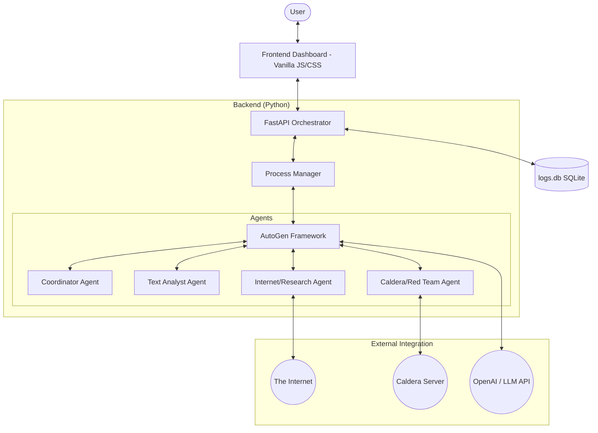

# 🛡️ Cyber Agent: Multi-Agent Offensive Security Framework

Welcome to the **Cyber Agent** project. This is a production-grade, multi-agent orchestration system designed to automate complex cybersecurity tasks using Large Language Models (LLMs). Built on top of Microsoft's **AutoGen**, it integrates seamlessly with offensive security tools like **Caldera** to perform everything from OSINT research to automated EDR detection.

---

## 🏗️ System Architecture

The system follows a modern decoupled architecture, separating the heavy-duty agent orchestration from the user interface.



---

## 🚀 Key Features

-   **🤖 Intelligent Multi-Agent Handshakes**: Agents collaborate dynamically. For example, a Research Agent might find a vulnerability, and an Analysis Agent will summarize it into a table.
-   **⚡ Live Dashboard**: A "Cyberpunk" themed terminal UI to monitor agent activity in real-time.
-   **🎯 Caldera Integration**: Direct integration with the Caldera C2 framework for executing remote commands on implants.
-   **🔍 Automated OSINT**: Agents can crawl CISA advisories, DFIR reports, and GitHub repositories to extract TTPs and telemetry gaps.
-   **🛠️ Modular Scenarios**: Easy to extend. Define a new sequence of tasks in a dictionary and run it immediately.

---

## 🛠️ How it Works (The "Pro-Beginner" Guide)

### 1. The Frontend (The Command Center)
The frontend is built using **Vanilla JavaScript** and **CSS**. It communicates with the backend via a REST API. It handles:
-   **Scenario Selection**: Lists all pre-defined agent workflows.
-   **Real-time Logging**: Displays a "scrolling terminal" feed of agent conversations.
-   **Status Monitoring**: Checks if the API and external servers (HTTP/FTP) are online.

### 2. The Backend (The Brain)
The backend uses **FastAPI**. It is the bridge between your browser and the Python agents.
-   **Orchestraion**: When you click "Run", the backend starts a new Python process specifically for that scenario.
-   **Log Management**: It listens to the agent output (`stdout`) and sends it to the frontend.
-   **Persistence**: Conversions are logged into a `logs.db` SQLite database for auditability.

### 3. The Agents (The Workers)
The "Agents" are powered by **AutoGen**. Think of them as specialized GPTs that can talk to each other:
-   **Task Coordinator**: The "Project Manager" that decides which agent should speak next.
-   **Text Analyst**: Good at summarizing, formatting data into tables, and "clean-up" tasks.
-   **Internet Agent**: Equipped with tools to download files and search the web.
-   **Caldera Agent**: Specialized in executing commands on remote targets via the Caldera API.

---

## 🔄 The Workflow: From Click to Result

1.  **Selection**: You choose a scenario, e.g., `DETECT_EDR`.
2.  **Handshake**: The **Task Coordinator** starts the chat.
3.  **Research (Internet Agent)**: Downloads a list of known EDR service names from GitHub.
4.  **Enumeration (Caldera Agent)**: Runs `Get-Service` on a remote Windows machine to list active services.
5.  **Correlation (Text Analyst)**: Compares the two lists and identifies if `CrowdStrike` or `Defender` is running.
6.  **Reporting**: The final result is formatted into a clean markdown table on your dashboard.

---

## 📂 Component Breakdown

| Component | Responsibility | Technology |
| :--- | :--- | :--- |
| `api.py` | REST API, static file serving, and subprocess handling. | FastAPI, Uvicorn |
| `ui/` | The visual command center. | HTML5, CSS3, Vanilla JS |
| `agents/` | Definitions of different agent roles and their prompts. | Python, AutoGen |
| `actions/` | The recipe book. Defines sequences of agent tasks. | Python |
| `tools/` | Custom Python functions agents can "call" (Web search, HTTP, etc.). | Python |
| `logs.db` | Permanent history of every agent interaction. | SQLite |

---

## 🚦 Getting Started

### Prerequisites
-   Python 3.10+
-   An OpenAI API Key (or other LLM provider supported by AutoGen)

### Installation
1.  **Clone & Setup**:
    ```bash
    git clone <your-repo-url>
    cd cyber-agent
    python -m venv .venv
    source .venv/bin/activate  # Or .venv\Scripts\activate on Windows
    pip install -r requirements.txt
    ```
2.  **Environment Variables**:
    Create a `.env` file based on `.env_template`:
    ```env
    OPENAI_API_KEY=your_key_here
    CALDERA_URL=http://your-caldera-ip:8888
    CALDERA_API_KEY=your_caldera_key
    ```
3.  **Run the System**:
    Start the backend and dashboard in one command:
    ```bash
    python api.py
    ```
    Now, visit **`http://localhost:8000/dashboard`** in your browser.

---

## ⚠️ Disclaimer
*This tool is intended for authorized security testing and educational purposes only. Always ensure you have permission before running agents against any network environment.*

---
*Created with ❤️ by the Cyber Agent Team.*
